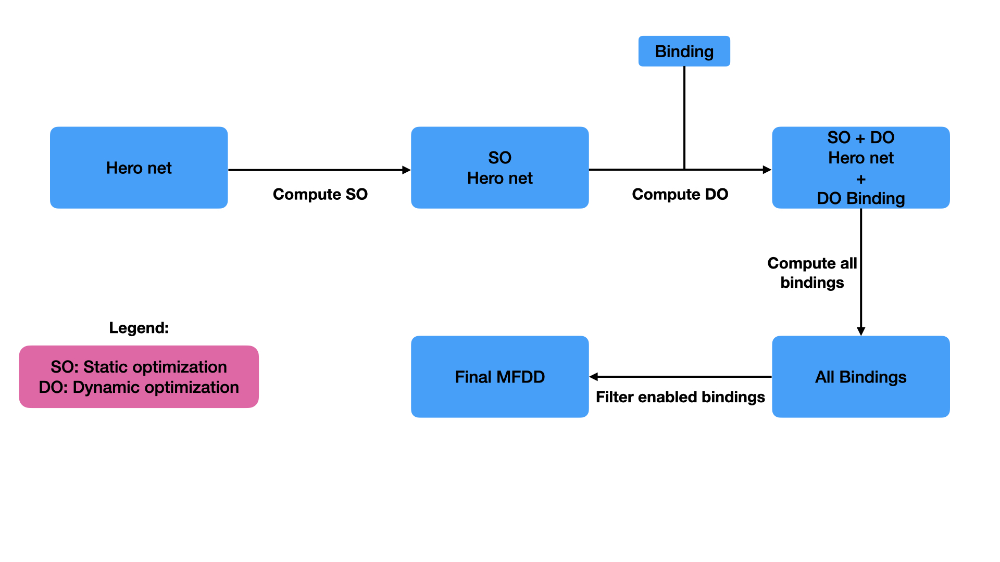
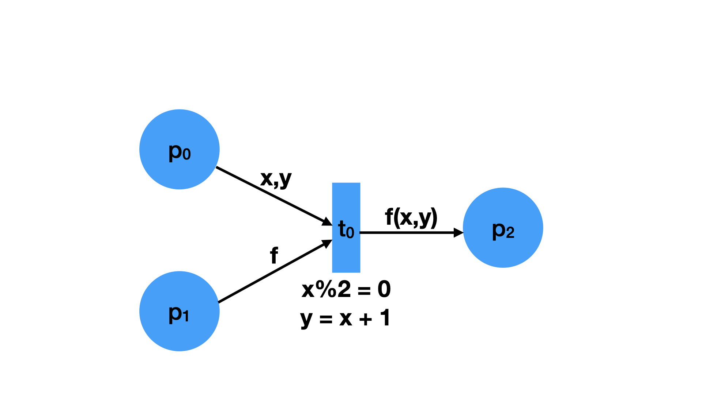

[](https://travis-ci.org/damdamo/HeroNets)

# Hero net

## General purpose

Hero net is a Swift library to create high-level Petri nets textually.
Hero net allows you to:
- Fire a transition using a given marking
- Compute enabled bindings efficiently, thanks to decision diagrams (DD).
- Compute state space

The library uses [AlpineLang](https://github.com/kyouko-taiga/AlpineLang) for the net inscription language.
Thus, every *AlpineLang* term can be used inside a Hero net, even higher-order functions !
Information about *AlpineLang* are directly available on the corresponding GitHub page.

## Pipeline

The work is for now mainly focused on a way of computing enabled bindings efficiently, in a regular high-level Petri net.
Compute a binding relies on a Hero net, a specific transition and a given marking.
A binding is nothing more than a mapping from variables to values, where each variable is assigned to a value.

The pipeline of this latter part is depicted in the figure below:



Steps are decomposed in 4 steps:
- Static optimization: Takes a Hero net and applies optimizations which depends only on the structure of the net. In the context of our net, there are of two kinds, constant and variable propagations.
Using guards, the list of conditions gives constraints that can be used to simplify the net. For instance, a condition that assigns a variable to value can be removed, by replacing the variable on the arc by the value. Same for variable, if there is a variable equal to another one, we substitute each variable by one of the both variable.

- Dynamic optimization: Takes a Hero net and a marking and applies modifications on both of them. This optimization is applied for a specific transition firing. In our case, the constants on the arcs are directly applied beforehand by removing the value inside the corresponding place.

- First homomorphism to compute all bindings: At first, we are not interested in checking guards, we just want to create all bindings.
In particular, we use map family decision diagrams (MFDD) - a kind of DD - to create a representation of each possible bindings for a place. Each MFDD that has been created for a place is then merge with the other one using a specific homomorphism. This homomorphism re uses the idea of concatenation and filter, to grow the space of possibilities, and filter values that have the same label name. Indeed, if two different arcs have the same label name, it is expected that they are assigned to the same value.

- Second homomorphism to filter conditions: Secondly, the latter MFDD is filtered using a homomorphism which takes conditions of the transition and applies them on the current MFDD.

## Small introduction to MFDD

The theory of the MFDD is related to the theory of Decision diagram [1].
<!-- A DD is a compact and implicit representation of a set of set of values. An example with the set notation: {{1,2,3}, {1,2}} -->
TODO

## How to import the library in your own Swift project with the Swift package manager ?

### For a library

In your `Package.swift`, add the following in the case of a library:

```swift
import PackageDescription

let package = Package(
    name: "YourProjectName",
    products: [
        .library(
            name: "YourProjectName",
            targets: ["YourProjectName"]),
    ],
    dependencies: [
        .package(url: "https://github.com/damdamo/HeroNets.git", .branch("master"))
    ],
    targets: [
        .target(
            name: "YourProjectName",
            dependencies: ["HeroNets"]),
        .testTarget(
            name: "YourProjectNameTests",
            dependencies: ["YourProjectName"]),
    ]
)
```

### For an executable

In your `Package.swift`, add the following in the case of an executable:

```swift
import PackageDescription

let package = Package(
    name: "YourProjectName",
    dependencies: [
        .package(url: "https://github.com/damdamo/HeroNets.git", .branch("master"))
    ],
    targets: [
        .executableTarget(
            name: "YourProjectName",
            dependencies: ["HeroNets"]),
        .testTarget(
            name: "YourProjectNameTests",
            dependencies: ["YourProjectName"]),
    ]
)
```

### A quick example

Here an example of a Hero net:



This example contains:
- 3 places: p0, p1, p2
- 1 transition: t0
- 3 label variables: x,y,z
- 2 conditions: *x%2 = 0* and *y = x + 1*

The Hero net that corresponds to this scheme is the following:

```swift
// Import library
import HeroNets
import Interpreter
import DDKit

// A simpler way to call a guard
typealias Guard = Pair<ILang, ILang>
// Variable type
typealias Var = String
// MFDD key
typealias KeyMFDDVar = KeyMFDD<Var>
// MFDD value
typealias ValueMFDD = Val

// Declaration of places using an enum
enum P: Place, Comparable {
  typealias Content = Multiset<Val>
  case p1,p2,p3
}

enum T: Transition {
  // Declaration of transitions using an enum
  case t1
}

// AlpineLang code that will be used later
let module: String = """
func add(_ x: Int, _ y: Int) -> Int ::
  x + y
"""

// We initialize the AlpinaLang interpreter
var interpreter = Interpreter()
try! interpreter.loadModule(fromString: module)

// We create beforehand the variables on the arcs
let x: ILang = .var("$x")
let y: ILang = .var("$y")
let f: ILang = .var("$f")

// Creates two conditions: x%2 == 0 && y == x + 1
let guards: [Guard] = [Pair(.exp("$x%2"), .val("0")), Pair(.var("$y"), .exp("$x + 1"))]

let model = HeroNet<P, T>(
  .pre(from: .p1, to: .t1, labeled: [x,y]),
  .pre(from: .p2, to: .t1, labeled: [f]),
  .post(from: .t1, to: .p3, labeled: [.exp("$f($x,$y)")]),
  guards: [.t1: guards],
  interpreter: interpreter
)

// We create a marking
let marking = Marking<P>([.p1: ["2", "3"], .p2: ["add"], .p3: []])

// Fire the transition t1 with from the marking `marking` with the binding ["$x": "2", "$y": "3", "$f": "add"].
let fireRes = model.fire(transition: .t1, from: marking, with: ["$x": "2", "$y": "3", "$f": "add"])

// Print: [p1: [:], p2: [5: 1], p3: [:]]
print(fireRes!)

// We create a new marking
let newMarking = Marking<P>([.p1: ["2", "3","4","5"], .p2: ["add"], .p3: []])
// We create a factory, that is used to store information
let factory = MFDDFactory<KeyMFDDVar,ValueMFDD>()

// We compute all enabled bindings
let enabledBindings = model.fireableBindings(for: .t1, with: newMarking, factory: factory)

// Print: [[$f: add, $x: 2, $y: 3], [$f: add, $x: 4, $y: 5]]
print(enabledBindings)

// Compute the state space
let stateSpace = model.computeStateSpaceBF(from: newMarking)
// Print:
//[
//  [p1: [5: 1, 4: 1], p2: [:], p3: [5: 1]],
//  [p2: [add: 1], p1: [5: 1, 4: 1, 3: 1, 2: 1], .p3: [:]],
//  [p3: [9: 1], p1: [3: 1, 2: 1], p2: [:]]
//]
print(stateSpace)
```

Thus, the example introduces how to apply all different operations on a Hero net.
Other examples can be found in the `Tests` folder.

## The inscription langage

You certainly noticed the type *ILang* from the previous example. It is a type for the inscription language, which encapsulates the term written in *AlpineLang*.

*AlpineLang* is a dynamic interpret programming language. We use the interpreter to evaluate a String (the code) and return a String.
Rather than just writing *String* everywhere in the net, an intermediate small language `ILang` (for inscription language) has been created with the following grammar:

```
ILang ::= var(String) | exp(String) | Val
Val   ::= cst(String) | btk
```

Where:
- *var* represents variable. A variable name must start by a dollar **$**.
- *exp* represents expression in *AlpineLang*.
- *cst* represents constant value in *AlpineLang*. The language is first-class citizen for functions, so a function is a value too.
- *btk* is a value for the black token.

## Structure of a Hero net / Marking

A Hero net is composed by:

- Places: Represented by an enumeration
- Transitions: Represented by an enumeration
- Arcs are a structure which is also composed by:
  - Pre arcs: From a place to a condition, and labels on the arc
  - Post arcs: From a transition to a place, and labels on the arc
- Labels: Represented by a multiset of ILang
- Guards: Represented by a list of Pair of ILang, which is verified if the result of their evaluation is equal.

A marking is just a *complete* mapping from each place to a multiset of values.

## References

[1] Akers, S. B. (1978). Binary decision diagrams. IEEE Transactions on computers, 27(06), 509-516.
